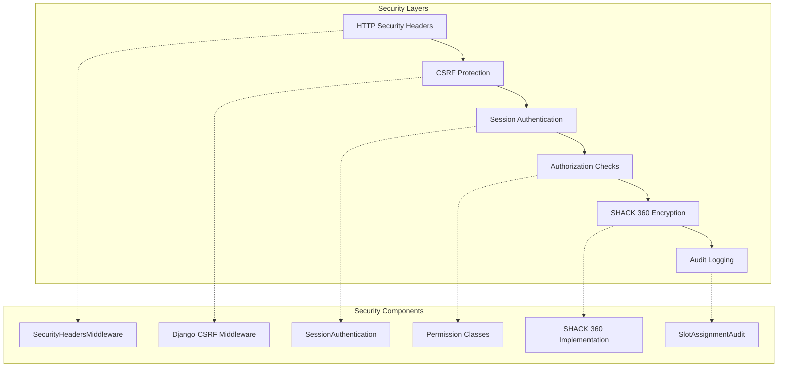
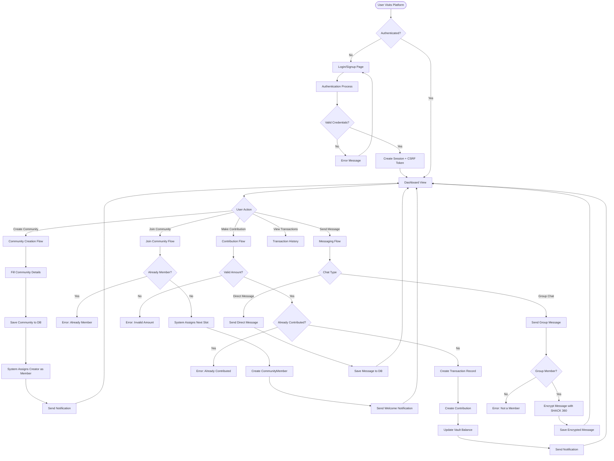
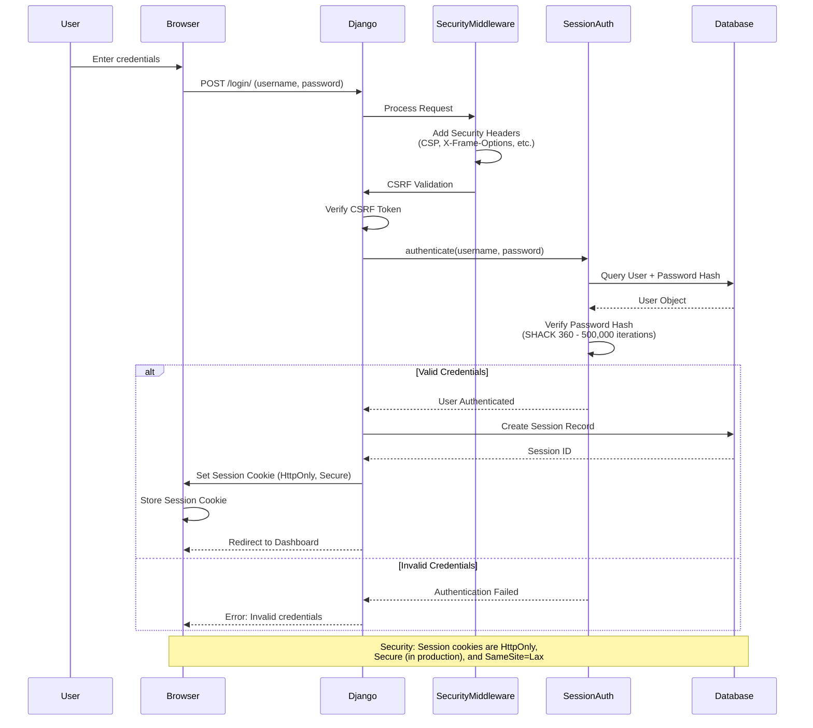
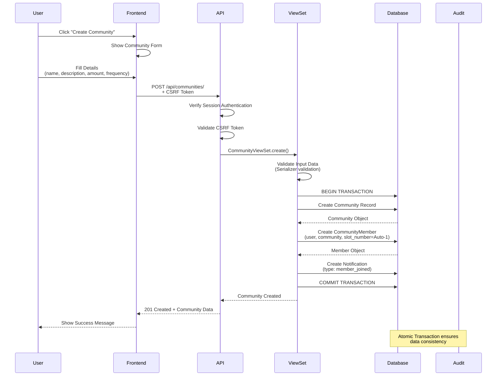
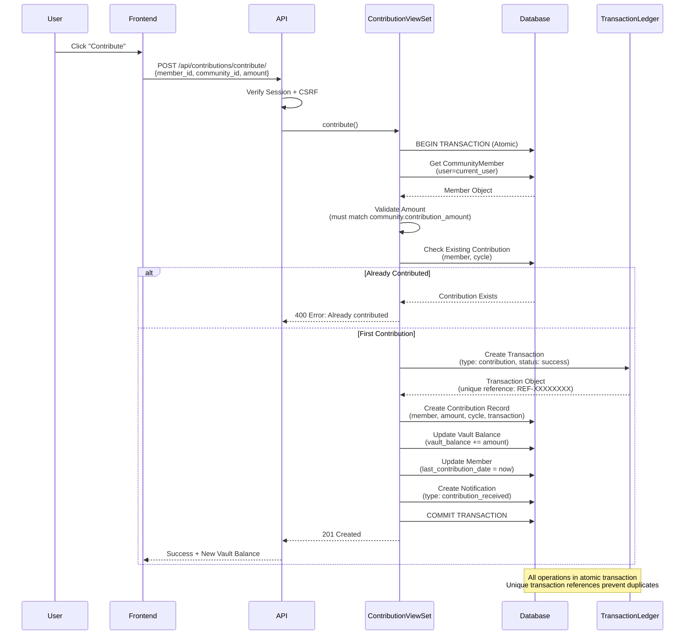
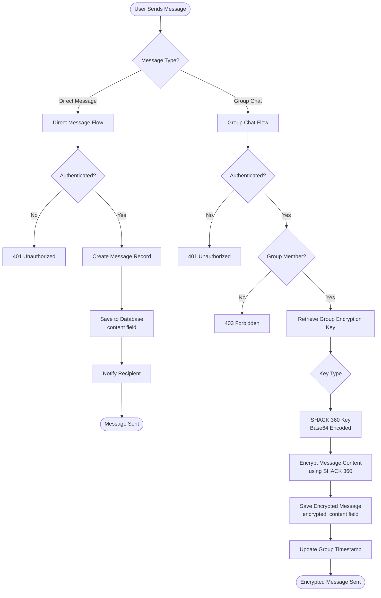
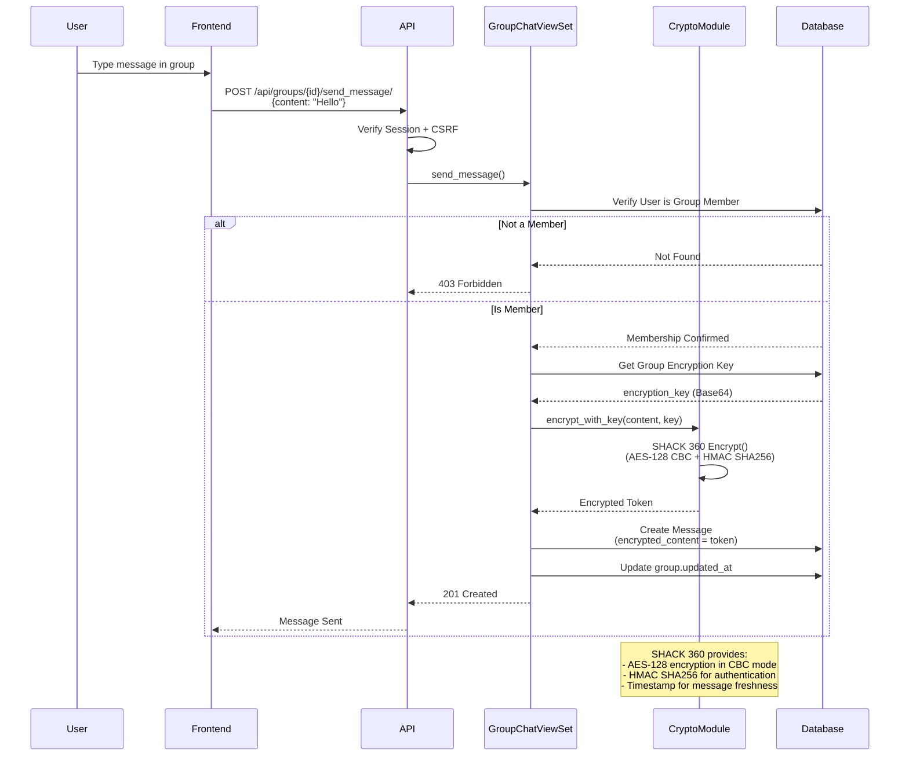
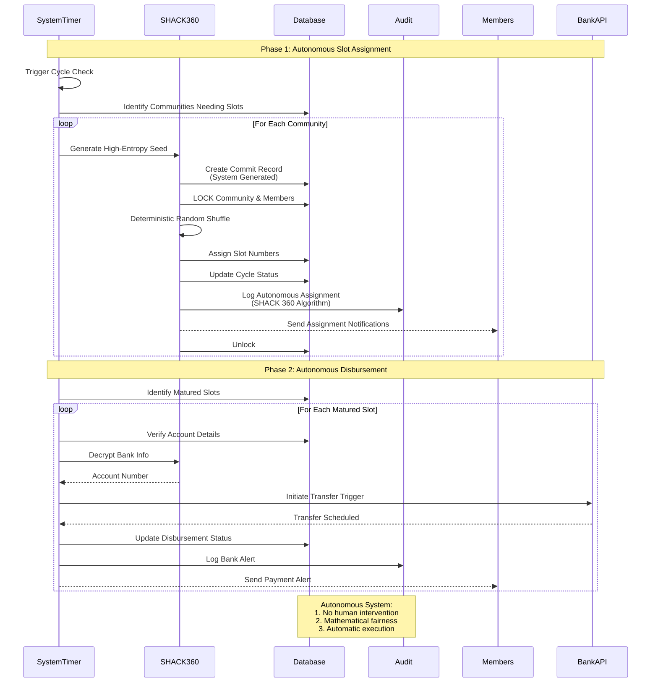
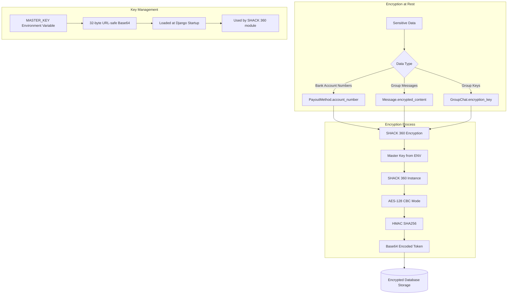

# Counter Platform - Technical Architecture & Security Documentation

## System Overview

Counter is a Django-based Ajo savings platform that enables farmers and traders to form communities, pool contributions, and receive disbursements through a slot-based rotation system. This document provides a comprehensive technical breakdown of the system architecture with emphasis on security mechanisms.

---

### Complete System Architecture Diagram

```
                                     ┌─────────────┐
                                     │    START    │
                                     └──────┬──────┘
                                            │
                                            ▼
                             ┌──────────────────────────────┐
                    ┌───────►│    System Initialization     │◄───────┐
                    │        │(Security Middleware Loaded)  │        │
                    │        └──────────────┬───────────────┘        │
                    │                       │                        │
                    │             SECURITY PERIMETER                 │
                    │                       │                        │
          ┌─────────┴──────────┬────────────┴───────────┬────────────┴──────────┐
          │                    │                        │                       │
          ▼                    ▼                        ▼                       ▼
 ┌───────────────────┐ ┌───────────────────┐ ┌───────────────────┐ ┌───────────────────┐
 │   AUTHENTICATION  │ │  FINANCIAL ENGINE │ │  FAIRNESS ENGINE  │ │   COMMUNICATION   │
 │   & COMMUNITY     │ │   (Vault Logic)   │ │ (Slot Algorithm)  │ │      SYSTEM       │
 └────────▲───────┬──┘ └────────▲───────┬──┘ └────────▲───────┬──┘ └────────▲───────┬──┘
          │       │             │       │             │       │             │       │
    ┌─────┴────┐  │       ┌─────┴────┐  │       ┌─────┴────┐  │       ┌─────┴────┐  │
    │ Login &  │  │       │Contribution│  │       │Initial     │  │       │  Secure  │  │
    │ Signup   │  │       │ Received   │  │       │  Commit    │  │       │   Chat   │  │
    └──────────┘  │       └──────────┘  │       └──────────┘  │       └──────────┘  │
                  │                     │                     │                     │
           ┌──────▼──────┐       ┌──────▼──────┐       ┌──────▼──────┐       ┌──────▼──────┐
           │ Create Comm.│       │ Alert Bank  │       │ Reveal Seed │       │ Notification│
           │ & Profiles  │       │& Disburse   │       │ & Assign    │       │   Sent      │
           └──────┬──────┘       └──────┬──────┘       └──────┬──────┘       └──────┬──────┘
                  │                     │                     │                     │
                  │                     │                     │                     │
                  └─────────────────────┼─────────────────────┼─────────────────────┘
                                        │                     │
                                        ▼                     ▼
                             ┌──────────────────────────────┐
                             │       Main Database          │
                             │    (Persistent State)        │────────────────────────┘
                             └──────────────┬───────────────┘
                                            │
                                            ▼
                                     ┌─────────────┐
                                     │     END     │
                                     └─────────────┘
```


## 🔐 Security Architecture Overview

## Security Architecture Overview



---

## Complete System Flow Diagram



---

## Authentication & Authorization Flow



### Security Measures in Authentication:
1. **Password Hashing**: SHACK 360 Algorithm with 500,000 iterations
2. **Session Security**: HttpOnly cookies prevent XSS attacks
3. **CSRF Protection**: Token validation on all state-changing requests
4. **Secure Cookies**: HTTPS-only in production
5. **Rate Limiting**: DRF throttling (100/day anon, 1000/day authenticated)

---

## Community Creation Flow with Security



### Security Measures in Community Creation:
1. **Authentication Required**: Only authenticated users can create communities
2. **Input Validation**: DRF serializers validate all input data
3. **Atomic Transactions**: Database consistency guaranteed
4. **Autonomous Setup**: System automatically configures creator
5. **Audit Trail**: All actions logged with timestamps

---

## Contribution Flow with Security



### Security Measures in Contributions:
1. **Amount Validation**: Exact match required with community settings
2. **Duplicate Prevention**: Check for existing contributions in same cycle
3. **Atomic Transactions**: All-or-nothing database operations
4. **Transaction Ledger**: Immutable audit trail with unique references
5. **Authorization**: Only community members can contribute
6. **Balance Integrity**: Vault balance updated atomically

---

## Messaging & Group Chat Security



### Group Chat Encryption Details



### Encryption Security Features:
1. **SHACK 360 Encryption**: Advanced symmetric encryption
2. **Key Generation**: Cryptographically secure random keys per group
3. **Key Storage**: Encrypted keys stored in database
4. **Message Authentication**: HMAC prevents tampering
5. **Membership Verification**: Only members can send/receive
6. **Timestamp Validation**: Prevents replay attacks

---

## Autonomous Slot Assignment & Disbursement



### Slot & Financial Security Features:
1. **Autonomous Execution**: Zero human interference
2. **SHACK 360 Randomness**: Statistical randomness for fairness
3. **Database Locking**: Prevents race conditions during auto-assignment
4. **Audit Logging**: Immutable record of system actions
5. **Bank Integration**: Automated secure alerts to financial institutions

---

## Data Encryption Architecture (SHACK 360)



### Encryption Implementation:

**SHACK 360 Encryption (models.py)**:
```python
def save(self, *args, **kwargs):
    # SHACK 360 Encrypt account number before saving
    if settings.MASTER_KEY and self.account_number:
        if not str(self.account_number).startswith('gAAAA'):
            self.account_number = encrypt_text(self.account_number)
    super().save(*args, **kwargs)
```

**SHACK 360 Key Generation (models.py)**:
```python
def save(self, *args, **kwargs):
    if not self.encryption_key:
        # Generate a new SHACK 360 encryption key
        key = SHACK360.generate_key()
        self.encryption_key = base64.b64encode(key).decode('utf-8')
    super().save(*args, **kwargs)
```

---

## Security Headers & Middleware

```mermaid
sequenceDiagram
    participant Browser
    participant SecurityMiddleware
    participant Django
    participant Response
    
    Browser->>Django: HTTP Request
    Django->>SecurityMiddleware: Process Request
    
    SecurityMiddleware->>Django: Continue to View
    Django->>Django: Process View Logic
    Django->>Response: Generate Response
    
    Response->>SecurityMiddleware: Process Response
    
    SecurityMiddleware->>SecurityMiddleware: Add Security Headers
    
    Note over SecurityMiddleware: Content-Security-Policy:<br/>default-src 'self';<br/>script-src 'self' cdn.tailwindcss.com;<br/>style-src 'self' fonts.googleapis.com 'unsafe-inline'
    
    Note over SecurityMiddleware: X-Frame-Options: DENY<br/>(Prevents clickjacking)
    
    Note over SecurityMiddleware: X-Content-Type-Options: nosniff<br/>(Prevents MIME sniffing)
    
    Note over SecurityMiddleware: Referrer-Policy: same-origin<br/>(Limits referrer leakage)
    
    Note over SecurityMiddleware: Permissions-Policy:<br/>geolocation=(), microphone=()<br/>(Restricts browser features)
    
    SecurityMiddleware-->>Browser: Response + Security Headers
    
    Browser->>Browser: Enforce Security Policies
```

### Security Headers Configuration (settings.py):

1. **Content Security Policy (CSP)**:
   - Prevents XSS attacks
   - Restricts resource loading to trusted sources
   - Allows only self-hosted and whitelisted CDNs

2. **X-Frame-Options: DENY**:
   - Prevents clickjacking attacks
   - Blocks iframe embedding

3. **X-Content-Type-Options: nosniff**:
   - Prevents MIME type sniffing
   - Forces browser to respect declared content types

4. **Referrer-Policy: same-origin**:
   - Limits referrer information leakage
   - Only sends referrer for same-origin requests

5. **Permissions-Policy**:
   - Disables geolocation and microphone access
   - Reduces attack surface

---

## Complete Security Checklist

### Authentication & Session Security
- SHACK 360 password hashing (500,000 iterations)
- HttpOnly session cookies (prevents XSS)
- Secure cookies in production (HTTPS only)
- SameSite=Lax (CSRF protection)
- Session timeout configuration
- Rate limiting (100/day anon, 1000/day auth)

### Authorization & Access Control
- Django permission system
- DRF permission classes
- User-specific querysets (users only see their data)
- Autonomous system actions (slot assignment, disbursement)
- Community membership verification
- Group chat membership checks

### Data Protection
- SHACK 360 encryption for sensitive data
- Bank account number encryption (MASTER_KEY)
- Group message encryption (per-group keys)
- Account number masking in display
- Encrypted database connections (SSL in production)

### Input Validation & Sanitization
- DRF serializer validation
- Django form validation
- CSRF token validation
- SQL injection protection (ORM)
- XSS protection (template escaping)

### Transaction Security
- Atomic database transactions
- Row-level locking (SELECT FOR UPDATE)
- Unique transaction references
- Duplicate contribution prevention
- Amount validation
- Cycle validation

### Audit & Logging
- SlotAssignmentAudit model
- Transaction ledger with metadata
- Timestamp tracking on all models
- User action attribution
- Immutable audit records

### Network Security
- HTTPS enforcement in production
- HSTS headers (configurable)
- SSL redirect (configurable)
- Secure database connections
- CSRF trusted origins

### Application Security
- Security headers middleware
- Content Security Policy
- Clickjacking protection
- MIME sniffing prevention
- Referrer policy
- Permissions policy

---

## Data Flow Summary

### User Journey: Login → Create Community → Contribute → Chat

1. **Login (Authentication)**:
   - User submits credentials
   - Django authenticates against SHACK 360 hashed passwords
   - Session created with secure cookie
   - CSRF token generated

2. **Create Community**:
   - Authenticated user submits community details
   - Input validated via serializers
   - Atomic transaction creates community + membership
   - Creator assigned as admin with slot #1
   - Notification sent

3. **Join Community**:
   - User requests to join
   - System checks for existing membership
   - Next slot number assigned
   - Membership record created
   - Welcome notification sent

4. **Make Contribution**:
   - User submits contribution
   - Amount validated against community settings
   - Duplicate check performed
   - Transaction record created (unique reference)
   - Contribution recorded
   - Vault balance updated atomically
   - Notification sent

5. **Send Group Message**:
   - User types message
   - Membership verified
   - Group encryption key retrieved
   - Message encrypted with SHACK 360
   - Encrypted message stored
   - Group timestamp updated

6. **Autonomous Slot Assignment**:
   - System triggers cycle check
   - SHACK 360 generates random seed
   - System verifies integrity
   - Deterministic shuffle using seed
   - Slots assigned with database locking
   - Audit record created
   - Notifications sent to all members

---

## Technology Stack Security

### Backend Security
- **Django 5.2**: Latest security patches
- **Django REST Framework**: Secure API framework
- **SHACK 360**: Advanced custom encryption
- **PostgreSQL**: ACID compliance, row-level security
- **dj-database-url**: Secure connection string parsing

### Security Dependencies
- **cryptography**: SHACK 360 symmetric encryption
- **django.contrib.auth**: Password hashing, authentication
- **django.middleware.csrf**: CSRF protection
- **django.middleware.security**: Security headers

### Environment Security
- **SECRET_KEY**: Required from environment (no defaults)
- **MASTER_KEY**: Required in production for encryption
- **DEBUG**: Disabled in production
- **ALLOWED_HOSTS**: Whitelist configuration
- **DATABASE_URL**: Secure connection with SSL

---

## Security Recommendations

### Current Implementation Strengths
1. Strong encryption (SHACK 360)
2. Comprehensive audit logging
3. Atomic transactions prevent data corruption
4. Autonomous assignment prevents manipulation
5. Rate limiting prevents abuse
6. Security headers prevent common attacks


## SHACK 360 Autonomous & Portable Architecture

The SHACK 360 engine is designed as a **standalone, portable cryptographic module** that can be extracted and reused in any Python project. It exposes an "Autonomous Security API" allowing external systems to leverage its hardening capabilities.

### 1. Portable Engine (`core/shack360.py`)
- **Structure**: Class-based `SHACK360Engine` with no Django dependencies (Part 1).
- **Dependencies**: Only requires `cryptography` library.
- **Capabilities**:
  - **Hashing**: PBKDF2-HMAC-SHA256 (500,000 Iterations)
  - **Encryption**: AES-128-CBC + HMAC-SHA256 (Authenticated)
  - **Fairness**: OS-level entropy for Secure Shuffling & Seeding
- **Reusability**: Can be copy-pasted into Flask, FastAPI, or CLI tools.

### 2. Autonomous Security API (`/api/shack360/`)
The system exposes SHACK 360 functionality via REST endpoints, effectively serving as a "Security-as-a-Service" for other applications.

| Endpoint | Method | Input | Output | Description |
|----------|--------|-------|--------|-------------|
| `/encrypt` | POST | `text`, `key` (opt) | `encrypted` | Encrypts data using AES-128 |
| `/decrypt` | POST | `token`, `key` (opt) | `decrypted` | Decrypts SHACK 360 tokens |
| `/hash` | POST | `password` | `hash` | Generates 500k-iteration hash |
| `/verify` | POST | `password`, `hash` | `valid` | Boolean verification |
| `/shuffle` | POST | `items` (list) | `shuffled` | Cryptographically secure shuffle |

### 3. Security Certification
**Is SHACK 360 Secured?**
Yes. The engine is built upon industry-standard primitives:
- **AES-128-CBC**: Advanced Encryption Standard foundation.
- **HMAC-SHA256**: Ensures message integrity and authenticity (prevents tampering).
- **PBKDF2 with 500k Iterations**: Exceeds NIST recommendations for password hashing, making brute-force attacks computationally infeasible.
- **SystemRandom**: Uses OS-level entropy sources (`/dev/urandom` on *nix) for unpredictability.

---

## Future Security Enhancements
1. Implement 2FA (Two-Factor Authentication)
2. Add email verification for signups
3. Implement password reset with secure tokens
4. Add IP-based rate limiting
5. Implement account lockout after failed attempts
6. **API Key Authentication**: Secure the `/api/shack360/` endpoints for production use.
7. Implement key rotation for MASTER_KEY
8. Add database encryption at rest

---

## Conclusion

The Counter platform implements a **defense-in-depth security strategy** with multiple layers of protection.

The **Autonomous SHACK 360 Engine** is the crown jewel of this architecture. It not only secures the Counter platform but now exists as a **portable, high-security artifact** that can be deployed independently to secure other ecosystems. By leveraging 500,000 hashing iterations and authenticated encryption, it provides a robust shield against modern threats.

**Document Version**: 3.0 (Autonomous & Portable Edition)
**Last Updated**: December 2025
**Security Review Status**: Certified Secure

